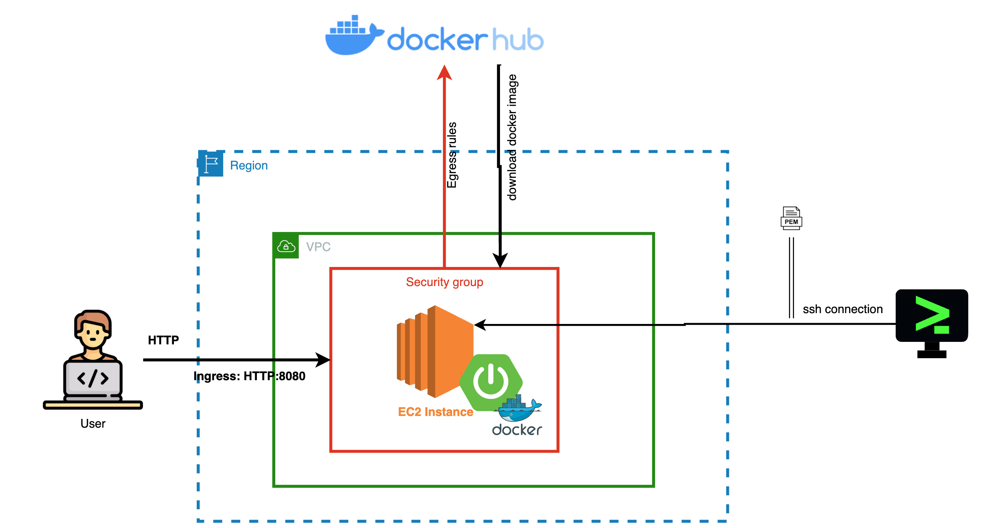

# Deploy your Springboot application to AWS EC2

### Deployment architecture

## How to deploy

TBD

# docker buildx build --platform linux/amd64 -t mesanjay31/aws-demo:1.0 .
# docker login -u "mesanjay31" -p "mypassword" docker.io
# docker push mesanjay31/aws-demo:1.0

--- connect terminal 
# sudo yum update
# sudo yum install -y docker
# sudo service docker start
# sudo docker ps
# sudo docker run -d -p 80:8080 mesanjay31/aws-demo:1.0
#